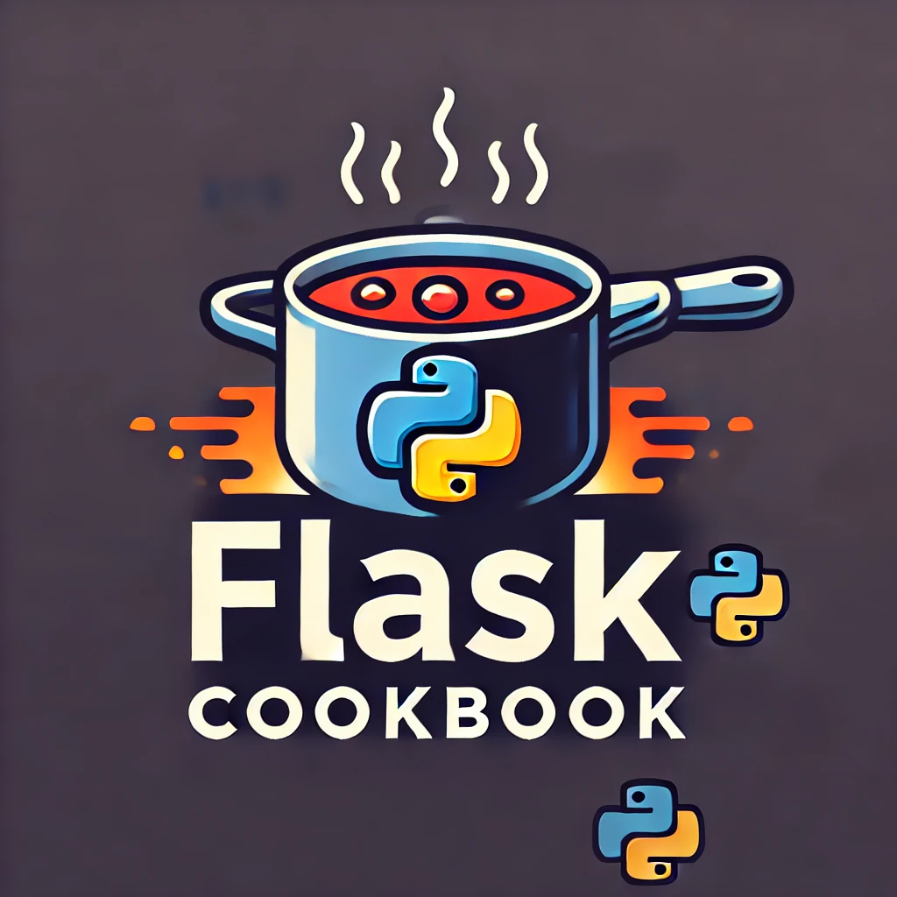

Dependencies:
- DietPi OS (tested on v9.11.2)
- python (3.9+)
- chromium-browser
- imagemagick (highly recommended, for adding images to recipes)
- dunst (optional, for voice assistant)
- notify-send (optional, for voice assistant)

Python dependencies:
- Flask
- SQLite
- Vosk (optional, for voice assistant)
- Porcupine (optional, for voice assistant)

Components:
- Web application to display the recipes (Flask)
- Database to store the recipes (SQLite)
- Assistant to listen to voice commands (Porcupine and Vosk)

## Installation
```bash
# Suggested installation directory on DietPi
cd /var/www/html
# Clone the repository
git clone https://github.com/nils-trubkin/flask-cookbook.git
cd flask-cookbook

# Install dependencies
# dunst and libnotify-bin are optional, for voice assistant
# imagemagick is highly recommended for adding images to recipes
sudo apt install python3 python3-pip python3-venv chromium-browser imagemagick dunst libnotify-bin unclutter xdotool dbus-x11 -y
python3 -m venv venv
. venv/bin/activate
pip install -r requirements.txt
cp .env.d .env
make

# Edit the service files to match your flask-cookbook directory if needed
nvim services/flaskapp.service
nvim services/assistant.service
sudo cp services/*.service /etc/systemd/system/

# Enable kiosk web application
sudo systemctl enable flask.service

# Enable voice assistant, requires free API key, explained below
sudo systemctl enable assistant.service

# Kiosk autostart script
cp chromium-autostart.sh /var/lib/dietpi/dietpi-software/installed/
chmod +x /var/lib/dietpi/dietpi-software/installed/chromium-autostart.sh

```
Configure the voice assistant API key in `.env` file in project root, if you want to use the voice assistant
The API key can be obtained (free for non-commercial use) from [PicoVoice](https://console.picovoice.ai/)
```bash
# .env
PICOVOICE_API_KEY=<your-api-key>
```
Configure boot to kiosk without desktop mode in dietpi-config
Configure homepage to `http://localhost:8001/list`
```bash
dietpi-config
```
(Optionally) Configure boot speed boost in dietpi-config
```bash
dietpi-config
```
## Wake word
The wake word for the voice assistant is "Hey Cookbook", this can be changed in `.env` file in project root
Custom word model file for Porcupine can be downloaded from [PicoVoice](https://console.picovoice.ai/) with a free account and placed in `wake_words` directory
```bash
# .env
WAKE_WORD_FILE=<name-of-wake-word-file>
```
## Tagging system
Recipes can optionally be tagged with categories, tags are defined in the recipe file with the `## Tags` header, for example:
These will be displayed in the web application as selectable chip-style buttons
```markdown
# Tags
dessert
```
## Timer
Voice assistant can set a timer for the recipe, the timer will be displayed in the web application (kiosk). Keyword is "timer <time>", for example: timer five

## Usage
```bash
# Start the kiosk web application
sudo systemctl start flask.service
# Start the voice assistant (if configured, see above)
sudo systemctl start assistant.service
```
visit `http://<ip>:8001` to view the web application.

## Generation of recipes
Place your recipes in the `recipes` directory, the recipes should be in markdown format with a defined structure, see the sample recipe for reference.
Images are optional, should be placed in the same directory as the recipe file and have same name as the recipe file with a different extension (jpg, jpeg, png). For example, `recipes/recipe.md` and `recipes/recipe.jpg`
```bash
make
```
or, if you want to specify the directory, such as a remote NAS or USB drive:
```bash
make RECIPES_DIR=<path>
```
to clean the recipes:
```bash
make clean
```

## TLS
To enable TLS, you need to generate a self-signed certificate and place it where user starting service has access to it, and update the flaskapp.service file to point to the certificate and key files, for example:
```bash
ExecStart=/var/www/html/flask-cookbook/venv/bin/python3 /var/www/html/flask-cookbook/venv/bin/gunicorn -w 4 -
b 0.0.0.0:8001 app:app --certfile=certs/cert.pem --keyfile=certs/cert.key
```
Alternatively, you can use a reverse proxy like nginx to handle TLS termination and forward requests to the Flask app.

## License
Apache License 2.0
Nils Trubkin, 2025
