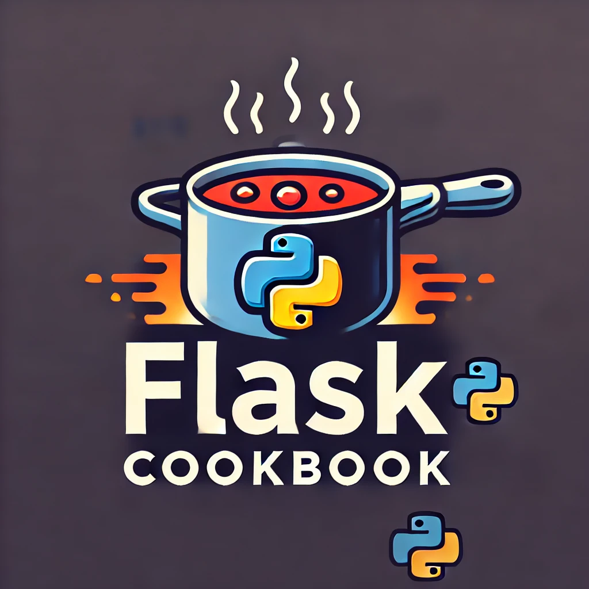

Dependencies:
- DietPi OS (tested on v9.11.2)
- python (3.9+)
- chromium-browser
- imagemagick (highly recommended, for adding images to recipes)
- dunst (optional, for voice assistant)
- notify-send (optional, for voice assistant)

Python dependencies:
- Flask
- SQLite
- Vosk (optional, for voice assistant)
- Porcupine (optional, for voice assistant)
- PyMuPDF (for receipt PDF processing)

Components:
- Web application to display the recipes (Flask)
- Database to store recipes, ingredients, barcodes, and receipts (SQLite)
- Assistant to listen to voice commands (Porcupine and Vosk)
- Receipt scanner to extract items and prices from PDF receipts
- Barcode-to-ingredient linking system for smart shopping

## Installation
```bash
# Suggested installation directory on DietPi
cd /var/www/html
# Clone the repository
git clone https://github.com/nils-trubkin/flask-cookbook.git
cd flask-cookbook

# Install dependencies
# dunst and libnotify-bin are optional, for voice assistant
# imagemagick is highly recommended for adding images to recipes
sudo apt install python3 python3-pip python3-venv chromium-browser imagemagick dunst libnotify-bin unclutter xdotool dbus-x11 -y
python3 -m venv venv
. venv/bin/activate
pip install -r requirements.txt
cp .env.d .env
make

# Edit the service files to match your flask-cookbook directory if needed
nvim services/flaskapp.service
nvim services/assistant.service
sudo cp services/*.service /etc/systemd/system/

# Enable kiosk web application
sudo systemctl enable flaskapp.service

# Enable voice assistant, requires free API key, explained below
sudo systemctl enable assistant.service

# Kiosk autostart script
cp chromium-autostart.sh /var/lib/dietpi/dietpi-software/installed/
chmod +x /var/lib/dietpi/dietpi-software/installed/chromium-autostart.sh

```
Configure the voice assistant API key in `.env` file in project root, if you want to use the voice assistant
The API key can be obtained (free for non-commercial use) from [PicoVoice](https://console.picovoice.ai/)
```bash
# .env
PICOVOICE_ACCESS_KEY=<your-api-key>
```

Configure boot to kiosk without desktop mode in dietpi-config. **Update the homepage URL to use your hostname instead of localhost:**
```bash
dietpi-config
# Set homepage to: http://<your-hostname>:8001/list
# Or if using HTTPS: https://<your-hostname>:8001/list
```

(Optionally) Configure boot speed boost in dietpi-config
```bash
dietpi-config
```

## Configuration
Update the `.env` file in the project root with your settings:

```bash
# Server configuration
HOSTNAME=your-hostname              # Set to your device hostname or IP
FLASK_PROTOCOL=http                 # Use 'https' if TLS is enabled
FLASK_HOST=0.0.0.0
FLASK_PORT=8001
FLASK_WORKERS=4

# Kiosk app
RECIPES_DIR=recipes

# Receipt scanner
RECEIPTS_DIR=receipts               # Directory containing PDF receipts

# Backup and restore
BACKUP_DIR=backups                  # Directory for ingredient barcode backups

# Voice assistant (if enabled)
PICOVOICE_ACCESS_KEY=<your-api-key>
WAKE_WORD_FILE=Hey-Cookbook_en_raspberry-pi_v3_0_0.ppn
MODEL_FILE=<optional-model-file>
```

## Wake word
The wake word for the voice assistant is "Hey Cookbook", this can be changed in `.env` file in project root
Custom word model file for Porcupine can be downloaded from [PicoVoice](https://console.picovoice.ai/) with a free account and placed in `wake_words` directory
```bash
# .env
WAKE_WORD_FILE=<name-of-wake-word-file>
```

## Tagging system
Recipes can optionally be tagged with categories, tags are defined in the recipe file with the `## Tags` header, for example:
These will be displayed in the web application as selectable chip-style buttons
```markdown
# Tags
dessert
```

## Timer
Voice assistant can set a timer for the recipe, the timer will be displayed in the web application (kiosk). Keyword is "timer <time>", for example: timer five

## Ingredient Tagging & Barcode Linking
Recipes can now link ingredients to barcodes for smart shopping. Tag ingredients in your markdown with the `@` symbol:

```markdown
## Ingredients
- 500g @flour
- 2 @eggs
- 1/2 cup @sugar
```

The ingredient tag will be automatically:
1. Created in the database
2. Linked to receipt items by barcode
3. Used to find the cheapest product variant across receipts

## Receipt Processing
Process PDF receipts to automatically track ingredient prices and build a shopping history:

```bash
# Place PDF receipts in the RECEIPTS_DIR (default: receipts/)
python3 generate_receipts.py
```

The script will:
- Extract store, date, time, items, and prices from PDFs
- Link items to ingredients by barcode
- Calculate normalized prices (price per unit)
- Find the cheapest ingredient variants

**Supported receipt formats:** Currently optimized for Swedish receipts. Regex patterns in `generate_receipts.py` can be customized for other formats.

## API Endpoints

### Recipes & Ingredients
- `GET /api/recipes` - Get all recipes with ingredients
- `GET /api/recipe?id=<recipe_id>` - Get a specific recipe
- `GET /api/ingredients` - Get all ingredients
- `GET /api/ingredient?id=<ingredient_id>` - Get a specific ingredient
- `GET /api/unlinked_ingredients` - Get ingredients not linked to any barcodes
- `GET /api/barcodes_by_ingredient_name?name=<ingredient_name>` - Get barcodes for an ingredient

### Barcode Management
- `POST /api/link_ingredient?ingredient_id=<id>&barcode=<barcode>&size=<size>&unit=<unit>` - Link ingredient to barcode
- `POST /api/unlink_ingredient?ingredient_id=<id>&barcode=<barcode>` - Remove barcode link
- `POST /api/update_barcode_size?barcode=<barcode>&size=<size>` - Update product size/quantity
- `POST /api/link_ingredient_to_barcode?barcode=<barcode>&ingredient=<ingredient_name>` - Link by name

### Receipts & Store Items
- `GET /api/receipts` - Get all receipts
- `GET /api/receipt?id=<receipt_id>` - Get a specific receipt
- `GET /api/store_items` - Get all store items
- `GET /api/store_item?id=<item_id>` - Get a specific store item

### Recipe View (Voice Command Compatible)
- `POST /api/recipes?name=<recipe_name>` - Open recipe view (used by voice assistant)

## Backup & Restore
Backup ingredient-barcode relationships to JSON for safe data migration:

```bash
# Create backup
python3 backup.py --backup

# Restore from backup
python3 backup.py --restore
```

Backups are stored in `BACKUP_DIR` (default: backups/) as `ingredient_barcodes_backup.json`

## Usage
```bash
# Start the kiosk web application
sudo systemctl start flaskapp.service
# Start the voice assistant (if configured, see above)
sudo systemctl start assistant.service
```
visit `http://<hostname>:8001` to view the web application.

## Generation of recipes
Place your recipes in the `recipes` directory, the recipes should be in markdown format with a defined structure, see the sample recipe for reference.
Images are optional, should be placed in the same directory as the recipe file and have same name as the recipe file with a different extension (jpg, jpeg, png). For example, `recipes/recipe.md` and `recipes/recipe.jpg`.

Generate or regenerate HTML from markdown:
```bash
make
```
or, if you want to specify the directory, such as a remote NAS or USB drive:
```bash
make RECIPES_DIR=<path>
```
to clean the recipes:
```bash
make clean
```

## TLS
To enable TLS, you need to generate a self-signed certificate and place it where user starting service has access to it, and update the flaskapp.service file to point to the certificate and key file.
```bash
openssl req -x509 -newkey rsa:4096 -nodes -out certs/cert.pem -keyout certs/cert.key -days 365
```

Update service file:
```bash
ExecStart=/var/www/html/flask-cookbook/venv/bin/gunicorn -w 4 -b 0.0.0.0:8001 app:app --certfile=certs/cert.pem --keyfile=certs/cert.key
```

Remember to change kiosk home page to the current hostname for it to work since 'localhost' will fail cert validation.

Alternatively, you can use a reverse proxy like nginx to handle TLS termination and forward requests to the Flask app.

## License
Apache License 2.0
Nils Trubkin, 2025
